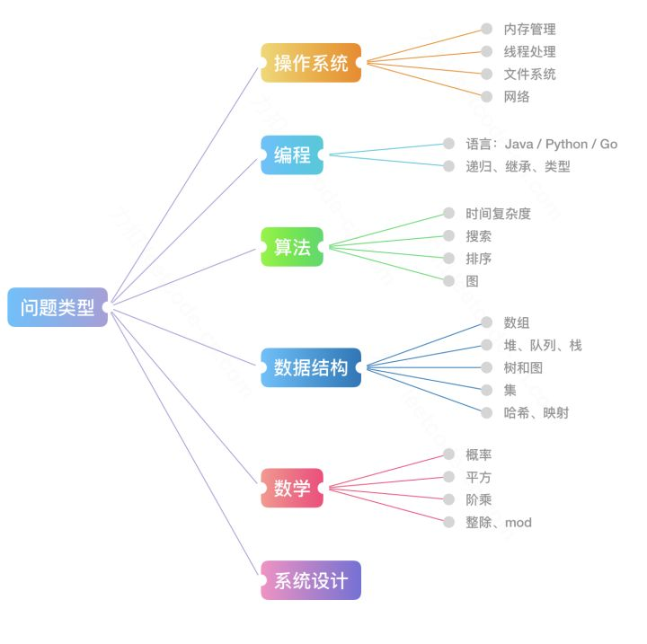
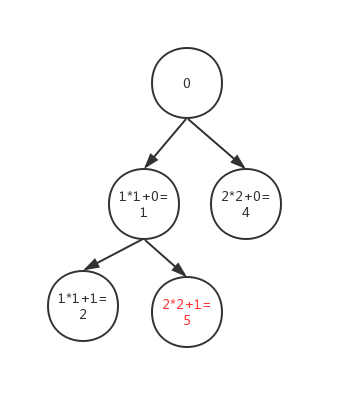

# :cat2: Clearest-LeetCode-Cpp-Solutions
Clearest LeetCode C++ Solutions. This project is intended to clarify the problem solving ideas. 我们追求的目标：清晰简单的思路 + 畅快巧妙的代码

# 前言
- 本项目意在收集 leetcode 中各大题型最清晰的解题思路 😉，帮助短时间内捋顺 C++ 编程知识体系、掌握常规通用、简单有效的解题方法，理解并记忆一些避免代码冗余的黑科技模块。
- 项目持续更新中，优先使用 C++，不支持的题目使用 C 代替，如果您有希望分享的清晰解法欢迎联系更新~ [直接发issue 或 fork，记得留下署名和联系方式 :bear:] 鉴于追求的主题，本项目收录题解需满足：1.思路简单清晰，容易理解 2.代码轻巧，不冗余 3.执行效率较高，时间复杂度低
- 水平有限，若您发现已存在的代码中如有冗余部分，欢迎 issue 或 PR。
- 另外这里有一份[ 🐍 Python 最短题解](https://github.com/cy69855522/Shortest-LeetCode-Python-Solutions)，带您体验 python 中各种让人叹为观止的奇巧解法，如果您对俩门语言都感兴趣的话，同时服用效果更佳。
- 欢迎加入QQ交流群：902025048 [∷二维码](QR.png) 群内提供更多相关资料~
- 推荐使用【Ctrl + F】按键搜索题号
# 专题探索


以上是一张互联网公司面试中经常考察的问题类型总结的思维导图，此栏目将根据 LeetCode 中文版探索板块给出的路线制作题解，各专栏将尽力覆盖各大知识要点并总结知识点和套路。相比于[题库解析](#题库解析)部分追求代码的绝对精简，本专题追求以**高可读性**呈现各大专题的**常规思路**，为后续的题库解析部分做铺垫。俩部分题目可能重复，但专题部分会有更详细的解析，且可能运用不同解法。

## 数据结构，说难也不难
### [队列 & 栈](https://leetcode-cn.com/explore/learn/card/queue-stack/)
- :black_joker:【知识卡片】**队列**中的数据呈线性排列，就和“队列”这个名字一样，把它想象成排成一 队的人更容易理解。在队列中，处理总是从第一名开始往后进行，而新来的人只能排在队尾。像队列这种最先进去的数据最先被取来，即“先进先出”的结构，我们称为 First In First Out，简称 FIFO
- :black_joker:【知识卡片】**栈**也是一种数据呈线性排列的数据结构，不过在这种结构中，我们只能访问最新添加的数 据。栈就像是一摞书，拿到新书时我们会把它放在书堆的最上面，取书时也只能从最上面的新书开始取。Last In First Out，简称 LIFO
- :black_joker:【知识卡片】**广度优先搜索 BFS **是一种对图进行搜索的算法。假设我们一开始位于某个顶点（即起点），此 时并不知道图的整体结构，而我们的目的是从起点开始顺着边搜索，直到到达指定顶点（即终 点）。在此过程中每走到一个顶点，就会判断一次它是否为终点。广度优先搜索会优先从离起点近的顶点开始搜索，这样由近及广的搜索方式也使得。根据 BFS 的特性，其常常被用于 `遍历` 和 `搜索最短路径`
- :tophat:【套路】**广度优先搜索一般流程**
	```
    # 1.初始化队列
    # 2.选择合适的根节点压入队列

    # 3.使用 while 进入队列循环，直到搜索完毕
    # {
    #   4.取出一个节点
    #   5.放入这个节点周围的节点
    # }
	```

**队列：先入先出的数据结构**
#### [622. 设计循环队列](https://leetcode-cn.com/problems/design-circular-queue/)
```cpp
代码
```
- 解析

**队列和广度优先搜索**
#### [200. 岛屿的个数](https://leetcode-cn.com/problems/number-of-islands/)
```cpp
class Solution {
public:
    bool inGrid(vector<vector<char>>& grid, pair <int,int> a) //判断点是否超出边界
    {
        if(a.first >= 0 && a.first < grid.size() && a.second >= 0 && a.second < grid[0].size())
            return true;
        else 
            return false;
    }
    
/*    void BFS(vector<vector<char>>& grid, queue<pair<int,int>>& po) //BFS的过程
    {
        if(po.empty()) return;
        pair <int,int> temp = po.front();
        po.pop();
        grid[temp.first][temp.second] = '0';
        pair <int,int> up = {temp.first + 1, temp.second}; 
        pair <int,int> down = {temp.first - 1, temp.second};
        pair <int,int> left = {temp.first, temp.second - 1};
        pair <int,int> right = {temp.first, temp.second + 1};
        if(inGrid(grid,up) && grid[temp.first + 1][temp.second] == '1') //若拓展出去的点仍在边界之内，且是岛屿的一部分，将其push入队列内，作为之后迭代的起始点
            po.push(up);
        if(inGrid(grid,down) && grid[temp.first - 1][temp.second] == '1')
            po.push(down);
        if(inGrid(grid,left) && grid[temp.first][temp.second - 1] == '1')
            po.push(left);
        if(inGrid(grid,right) && grid[temp.first][temp.second + 1] == '1')
            po.push(right);
        return BFS(grid,po);
    }
    */
    int numIslands(vector<vector<char>>& grid) {
        int ans = 0;
        queue <pair<int,int>> po;
        if(grid.empty()) return 0; //若地图为空，直接返回0
        int m = grid.size();
        int n = grid[0].size();
        for(int y = 0; y < m; ++y) //遍历整张地图的每个点
        {
            for(int x = 0; x <n; ++x)
            {
                if(grid[y][x] == '1') //若bool值为true，该点为新发现的岛屿的起始点
                {
                    po.push({y,x});
                    //BFS(grid,po);
                    ++ans; //岛屿数加一
                    while(!po.empty()) //进入广度优先搜索
                    {
                        
                        pair <int,int> temp = po.front();
                        po.pop();
                        if(grid[temp.first][temp.second] == '0')
                            continue;
                        grid[temp.first][temp.second] = '0';
                        pair <int,int> up = {temp.first + 1, temp.second}; 
                        pair <int,int> down = {temp.first - 1, temp.second};
                        pair <int,int> left = {temp.first, temp.second - 1};
                        pair <int,int> right = {temp.first, temp.second + 1};
                        if(inGrid(grid,up) && grid[temp.first + 1][temp.second] == '1') //若拓展出去的点仍在边界之内，且是岛屿的一部分，将其push入队列内，作为之后迭代的起始点
                            po.push(up);
                        if(inGrid(grid,down) && grid[temp.first - 1][temp.second] == '1')
                            po.push(down);
                        if(inGrid(grid,left) && grid[temp.first][temp.second - 1] == '1')
                            po.push(left);
                        if(inGrid(grid,right) && grid[temp.first][temp.second + 1] == '1')
                            po.push(right);
                    }
                    
                }
            }
        }
        return ans;
    }
};
```
- 这里用queue来实现BFS来解决这道题。使用了queue先入先出的性质
- 想象：先搜索到一个岛屿的某点，先遍历该点的四周，将‘1’转化为0，进入下一个候补点，再遍历四周……以此类推直到遍历完整座岛屿（‘1’）

#### [752. 打开转盘锁  队列+广度优先搜索](https://leetcode-cn.com/problems/open-the-lock/submissions/)
```cpp
class Solution {
public:
    int openLock(vector<string>& deadends, string target) {
        set<string> dead(deadends.begin(),deadends.end()); //收录死锁的数据
        set<string> done; //用来记录已经遍历过的数字
        string beginstr = "0000"; //记录起始数据
        done.insert(beginstr);
        
        // BFS 从这里开始--------------------------------------------------------------
        queue<pair<int,string>>record; //创建队列记录当前深度和节点
        record.push({0,beginstr});
        
        if (dead.count(beginstr)) return -1; //如果死锁数据中包含起始数据，直接返回-1
        
        while(!record.empty()) //用BSF遍历所有可能的数据
        {
            auto tmp=record.front(); //提取队列中第一个数据
            record.pop();
            
            if (tmp.second==target) return tmp.first; //将目标的判断放在加减操作之前，还可以判断起始数据是否是目标数据，较严谨
            for (int i=0; i<4; i++) //对提取出来的数据的每一位做+1和-1的操作
            {
                string spls = tmp.second;
                string ssbs = tmp.second;
                spls[i] = (spls[i] - '0' + 1) % 10 +'0'; //用mod来处理循环的数字
                ssbs[i] = ((ssbs[i] - '0') + 9) % 10 + '0';
                if (!dead.count(spls) && !done.count(spls)) //若加一后的数据不存在死锁集合中，且不是之前遍历过的数据
                {
                    record.push({tmp.first+1, spls}); //加到record队列中
                    done.insert(spls);
                }
                if (!dead.count(ssbs) && !done.count(ssbs)) //若减一后的数据不存在死锁集合中，且，不是之前遍历过的数据
                {
                    record.push({tmp.first+1, ssbs}); // 加到record队列中
                    done.insert(ssbs);
                }
            }
        }
        return -1; //若无法得到目标密码，返回-1
    }
};

```
- 使用BFS解题的关键：1.根节点是什么？周围节点是哪些？什么时候停止？
- 本题通过使用BFS，将问题转化为一个图，每一个点都与其它八个点相连接e.g. 0000 与0001，0009，0010，0090，0100，0900，1000，9000八个点相连，通过对每一个点的每一位数进行+1和-1的操作获得新的点，判断新的点是否在死锁集合内
- dead集合的作用有两点：①题目给的deadends变量是数组类型的，每次判断某个目标是否在其中需要遍历一边数组，时间复杂度O(N),而dead变量是set类型的，内部实现是哈希表，每次根据key取value值的时间复杂度是O(1),快非常多。  ②因为题目给出的deadends中有很多重复的内容，所以判断的时候重复的值也搜索一遍更慢了，使用set可以把所有重复的值去掉。
- 若不设置集合储存遍历过的点，会产生无限循环。
- 本题使用mod和ASCII码来处理9->0和0->9的转换；也可设置两个flag1，flag2，当flag==‘9’+1或‘0’-1时，对答案进行重新赋值。
- 可以通过first和second的调用来分别访问队列对中的数据； continue仅跳出一层循环一次。
#### [279. 完全平方数  队列+广度优先搜索](https://leetcode.com/problems/perfect-squares/)
```cpp
class Solution {
public:
    int numSquares(int n) {
        vector <int> f (n+1,-1); //初始化 构造一个数组，容量为n+1，所有空间初始化为-1
        f[0] = 0; //组成0的完全平方数的个数为0
        
        //BFS从这里开始-------------------------
        queue <int> q; 构造一个队列储存nodes，等待处理
        q.push(0);
        while (!q.empty())
        {
            int m = q.front(); //取出第一个数据
            q.pop();
            for(int i = 1; i*i+m <=n; i++) //最小的完全平方数是1
            {
                if(f[i*i+m] == -1) //若i*i+m这个数字还没有出现过
                {
                    f[i*i+m] = f[m] + 1; //加一次完全平方数，步骤加一
                    q.push(i*i+m); //放入队列，接着搜索
                }
            }
        }
        return f[n];
    }
};
```
- 本题使用队列+广度优先搜索来解决， 思维过程：以n=5为例，通过构建树形图形，root是0，通过第一次for循环，构建第一层node，此时m为0。如图
- 
- 因为队列FIFO的性质，先达到目标的必是最少的个数

**栈：后入先出的数据结构**
#### [155. Min Stack 栈](https://leetcode.com/problems/min-stack/)
```cpp
class MinStack {
public:
    /** initialize your data structure here. */
    stack<int>s; //主数据栈
    stack<int>minn; //辅助数据栈
    MinStack() {
        
    }
    
    void push(int x) {
        s.push(x);
        if(minn.empty()||x<=minn.top()) //关键点，见总结
            minn.push(x);
    }
    
    void pop() {
        if(s.top() == minn.top()) //判断数据栈的顶部是否是当前主数据栈的最小值，若是，需要将两个栈的top都pop掉
            minn.pop();
        s.pop();
    }
    
    int top() {
        return s.top(); //返回栈的顶部
    }
    
    int getMin() {
        return minn.top(); //返回最小值
    }
};
```
- 本题使用双栈，利用栈的后入先出的特性，将最小值推入minn栈，使minn栈的top始终为s栈的最小值。
- 关键点：判断条件为当minn栈为空，或当前数据小于等于minn栈的top值。条件若为true，则将当前数据也push到minn栈中。若判断条件改为‘小于’minn栈的top值，而不是‘小于等于’minn栈的top值时，代码提交失败。问题在于，测试数据可能有大于1个的最小值，若s栈中的最小值个数多于1个，当minn栈和s栈的最小值被pop一个后，s栈中还有之前的最小值，而minn栈中的最小值变得比s栈中的最小值大，答案error。
#### [20. Valid parentheses 栈](https://leetcode.com/problems/valid-parentheses/)
```cpp
class Solution {
public:
    bool isValid(string s) {
        if(s.size() % 2 != 0) return false; //若字符串s的字符数不为偶数，直接返回false.  不过没有也可
        stack <char> a; 
        map <char,char> bra; //建立右括号和左括号之间的映射
        bra.insert(pair<char,char>(')','('));
        bra.insert(pair<char,char>(']','['));
        bra.insert(pair<char,char>('}','{'));
        int lo;
        lo = s.size();
        for(int i = 0; i < lo; i++)
        {
            if(s[i] == '(' || s[i] == '[' || s[i] == '{') //若是左括号，直接推入栈
                a.push(s[i]);
            if(s[i] == ')' || s[i] == ']' || s[i] == '}') //若是右括号，先判断栈内是否有左括号
            {
                if(a.empty()) //见总结*
                    return false;
                if(bra[s[i]] == a.top()) //若右括号与栈顶的左括号匹配，pop掉栈a最上方的左括号，否则返回false
                {
                    a.pop();
                }
                else
                    return false;
            }
        }
        if(a.empty()) //若操作之后，栈内还有字符，返回false
            return true;
        else
            return false;
    }
};
```
- 有效的括号，通过建立左右括号之间的映射。使用栈后入先出的性质，压入左括号，若右括号和栈中顶部的左括号匹配，且最终栈内没有字符，返回true
- 当操作右括号前，要判断栈是否为空，若缺少这一步，当栈内为空，右括号需要与空栈的top判断段是否相等的时候，会报错。
### [739. Daily Temperatures栈](https://leetcode.com/problems/daily-temperatures/)
```cpp
class Solution {
public:
    vector<int> dailyTemperatures(vector<int>& T) {
        vector <int> ans (T.size(), 0); //创建与气温天数相同的数组，收录答案
        stack <int> res; 
        for(int i = T.size()-1; i >= 0; --i) //从最后一天开始往前
        {
            while(!res.empty() && T[i] >= T[res.top()]) res.pop(); //若当前数据大于等于栈顶数据，pop掉栈顶数据直到栈为空或当前数据小于栈顶数据
            if(res.empty())
                ans[i] = 0;
            else
                ans[i] = res.top() - i;
            res.push(i); //栈顶始终是整个栈的最小数据
        }
        return ans;
    }
};
```
- 创建一个递减栈 后入栈的元素总比先入栈的元素小。
- 若当前数据比栈top数据小， 则入栈；若当前数据比栈top大，先pop栈，直到当前数据比栈的top数据小，再入栈。
- 索引相减
### [150. Evaluate Reverse Polish Notation栈](https://leetcode.com/problems/evaluate-reverse-polish-notation/)
```cpp
class Solution {
public:
    int str2num(string s) //将string转换为int类型的函数，在之后要调用
    {   
        int num;
        stringstream ss(s);
        ss>>num;
        return num;
    }
    int evalRPN(vector<string>& tokens) {
        stack <int> s;
        int n = tokens.size();
        int ans;
        if(tokens[0] != "+" && tokens[0] != "-" && tokens[0] != "*" && tokens[0] != "/") //防止测试数据仅有一个数字
            ans = str2num(tokens[0]);
        for(int i = 0; i <= n - 1 ; ++i) //运算过程
        {
            if(tokens[i] == "+")
            {
                int right = s.top();
                s.pop();
                int left = s.top();
                s.pop();
                ans = left + right;
                s.push(ans);
            }
            else if(tokens[i] == "-")
            {
                int right = s.top();
                s.pop();
                int left = s.top();
                s.pop();
                ans = left - right;
                s.push(ans);
            }
            else if(tokens[i] == "*")
            {
                int right = s.top();
                s.pop();
                int left = s.top();
                s.pop();
                ans = left * right;
                s.push(ans);
            }
            else if(tokens[i] == "/")
            {
                int right = s.top();
                s.pop();
                int left = s.top();
                s.pop();
                ans = left / right;
                s.push(ans);
            }
            else
            {
                int r = str2num(tokens[i]); //遇到数字直接push
                s.push(r);
            }
        }
        return ans;
    }
};
```
- 本题使用栈后入先出的性质，当遇到算术运算符时，pop出最近进入栈内的两个数字进行运算。运算后需要将结果push回栈内进行下一次运算。
- 当遇到的不是算术运算符时，那就是数字了。直接push到栈中等待运算。
- 注意：本题的初始数据是string类型，需要将其转换成int类型。

**栈和深度优先搜索**
### [200. Number of Islands栈+DFS](https://leetcode.com/problems/number-of-islands/)
```cpp
class Solution {
public:
    bool inGrid(vector<vector<char>>& grid, pair <int,int> a) //判断点是否超出边界
    {
        if(a.first >= 0 && a.first < grid.size() && a.second >= 0 && a.second < grid[0].size())
            return true;
        else 
            return false;
    }
    
    void DFS(vector<vector<char>>& grid, stack<pair<int,int>>& po) //DFS的过程
    {
        if(po.empty()) return;
        pair <int,int> temp = po.top();
        po.pop();
        grid[temp.first][temp.second] = '0';
        pair <int,int> up = {temp.first + 1, temp.second}; 
        pair <int,int> down = {temp.first - 1, temp.second};
        pair <int,int> left = {temp.first, temp.second - 1};
        pair <int,int> right = {temp.first, temp.second + 1};
        if(inGrid(grid,up) && grid[temp.first + 1][temp.second] == '1') //若拓展出去的点仍在边界之内，且是岛屿的一部分，将其push入栈内，作为之后迭代的起始点
            po.push(up);
        if(inGrid(grid,down) && grid[temp.first - 1][temp.second] == '1')
            po.push(down);
        if(inGrid(grid,left) && grid[temp.first][temp.second - 1] == '1')
            po.push(left);
        if(inGrid(grid,right) && grid[temp.first][temp.second + 1] == '1')
            po.push(right);
        return DFS(grid,po);
    }
    
    int numIslands(vector<vector<char>>& grid) {
        int ans = 0;
        stack <pair<int,int>> po;
        if(grid.empty()) return 0; //若地图为空，直接返回0
        int m = grid.size();
        int n = grid[0].size();
        for(int y = 0; y < m; ++y) //遍历整张地图的每个点
        {
            for(int x = 0; x <n; ++x)
            {
                if(grid[y][x] == '1') //若bool值为true，该点为新发现的岛屿的起始点
                {
                    po.push({y,x});
                    DFS(grid,po); //进入深度优先搜索
                    ++ans; //岛屿数加一
                }
            }
        }
        return ans;
    }
};
```
- 这里用stack 和DFS数据结构来做这道题，stack 后入先出的数据类型，DFS：选择最新的数据作为候补顶点。
- 首先，开始先遍历地图，直到遇到第一个‘1’（岛屿），以它为root开始通过DFS搜索这座岛屿的其它部分，并把他们全部转化为‘0’，同时把岛屿数量+1。之后接着遍历地图，由于我们将搜索过的岛屿转化为‘0’，因此不会重复搜索。
- 测试用例有空集，因此需要在搜索开始前判断地图是否为空，若为空直接返回0。
### [494. Target Sum  DFS](https://leetcode.com/problems/target-sum/)
```cpp
class Solution {
public:
    void DFS(vector<int>& nums, int S, int& count, int counter, int sum) //DFS函数
    {
        if(counter == nums.size())
        {
            if(sum == S)
                ++ count;
            return;
        }
        DFS(nums, S, count, counter + 1, sum + nums[counter]);
        DFS(nums, S, count, counter + 1, sum -  nums[counter]);
    }
    int findTargetSumWays(vector<int>& nums, int S) {
        int count = 0;
        int sum = 0;
        DFS(nums, S, count, 0, sum);
        return count;
    }
};
```
- 本题使用DFS来实现，通过计数器counter来记录深度，不断迭代直到遍历完数组内的全部数据。
- 记下符合目标的支路。
### [94. Binary Tree Inorder Traversal](https://leetcode.com/problems/binary-tree-inorder-traversal/)
```cpp
class Solution {
public:
    vector <int> rest;
    vector<int> inorderTraversal(TreeNode* root) {
        if(root != NULL)
        {
            inorderTraversal(root -> left);
            rest.push_back(root -> val);
            inorderTraversal(root -> right);
        }
        return rest;
    }
};
```
- 考察到一个节点后，将其暂存，遍历完左子树后，再输出该节点的值，然后遍历右子树。(左根右)
### [232. Implement Queue using Stacks 用双栈实现队列](https://leetcode.com/problems/implement-queue-using-stacks/)
```cpp
class MyQueue {
public:
    /** Initialize your data structure here. */
    stack <int> a;
    stack <int> b;
    MyQueue() {
        
    }
    
    /** Push element x to the back of queue. */
    void push(int x) {
        a.push(x);
    }
    
    /** Removes the element from in front of queue and returns that element. */
    int pop() {
        int len;
        len = a.size();
        for(int i = 0; i < len; ++i)
        {
            b.push(a.top());
            a.pop();
        }
        int cur;
        cur = b.top();
        b.pop();
        for(int j = 0; j < len - 1; ++j)
        {
            a.push(b.top());
            b.pop();
        }
        return cur;
    }
    
    /** Get the front element. */
    int peek() {
        int len;
        len = a.size();
        for(int i = 0; i < len; ++i)
        {
            b.push(a.top());
            a.pop();
        }
        int cur;
        cur = b.top();
        for(int j = 0; j < len; ++j)
        {
            a.push(b.top());
            b.pop();
        }
        return cur;
    }
    
    /** Returns whether the queue is empty. */
    bool empty() {
        return a.empty() && b.empty();
    }
};
```
- 使用双栈的原因：能通过b栈将原a栈的数据倒置，此时栈的top，也就是队列的peek。可以实现队列的peek和pop操作。操作完再把b栈转换回a栈，这样当再push数据进栈的时候顺序才会正确。
### [225. Implement Stack using Queues 用队列实现栈](https://leetcode.com/problems/implement-stack-using-queues/)
```cpp
class MyStack {
public:
    /** Initialize your data structure here. */
    queue <int> q1;
    queue <int> q2;
    MyStack() {
        
    }
    
    /** Push element x onto stack. */
    void push(int x) { //保证数据全部push到同一个队列
       if(q1.empty())
            q2.push(x);
        else
            q1.push(x);
    }
    
    /** Removes the element on top of the stack and returns that element. */
    int pop() {
        if(q1.empty())
        {
            int len = q2.size();
            for(int i = 0; i<len - 1; ++i) //将有数据的队列的数据除了最后一个以外，全部push到另一个队列。
            {
                q1.push(q2.front());
                q2.pop();
            }
            int a=q2.front();
            q2.pop();
            return a;
            
        }
        else
        {
            int len = q1.size();
            for(int i = 0; i<len - 1; ++i) //同上
            {
                q2.push(q1.front());
                q1.pop();
            }
            int a=q1.front();
            q1.pop();
            return a;
            
        }
        
    }
    
    /** Get the top element. */
    int top() {
        if(q1.empty())
        {
            //q2.size()
            int len = q2.size();
            for(int i = 0; i<len - 1; ++i) //同上
            {
                q1.push(q2.front());
                q2.pop();
            }
            int a = q2.front();
            q1.push(q2.front());
            q2.pop();
            return a;
            
        }
        else
        {
            int len = q1.size();
            for(int i = 0; i<len-1; ++i) //同上
            {
                q2.push(q1.front());
                q1.pop();
            }
            int a = q1.front();
            q2.push(q1.front());
            q1.pop();
            return a;
            
        }
    }
    
    /** Returns whether the stack is empty. */
    bool empty() {
        return q1.empty() && q2.empty();
    }
};

```
- push： 两种数据结构的push方法相同，都是在数据的后面压入数据。
- pop： 队列的pop是从前面开始，即从数据的front部分； 而栈的pop从后面开始，即从数据的top部分
- top： 操作位置与pop类似，只是只返回值，不删除数据。 
- 由此可知，我们本题的关键是实现pop 和top的操作。我们通过两个队列的相互配合来实现栈。 例如，若a队列存有数据，将数据除了最后一项全部推入b队列，由于是先入先出，数据的顺序不变。a队列还剩下一个数据，当队列的数据仅剩一个时，该数据既是队列的第一个数据，也是队列的最后一个数据，通过pop（）和front（）函数的调用，可以产生相应的栈的pop（）和top（）的作用。
### [394. Decode String 栈](https://leetcode.com/problems/decode-string/)
```cpp
class Solution {
public:
    string decodeString(string s) {
        string res = "";
        stack <int> nums;
        stack <string> strs;
        int num = 0;
        int len = s.size();
        for(int i = 0; i < len; ++ i)
        {
            if(s[i] >= '0' && s[i] <= '9')
            {
                num = num * 10 + s[i] - '0';
            }
            else if((s[i] >= 'a' && s[i] <= 'z') ||(s[i] >= 'A' && s[i] <= 'Z'))
            {
                res = res + s[i];
            }
            else if(s[i] == '[') //将‘[’前的数字压入nums栈内， 字母字符串压入strs栈内
            {
                nums.push(num);
                num = 0;
                strs.push(res); 
                res = "";
            }
            else //遇到‘]’时，操作与之相配的‘[’之间的字符，使用分配律
            {
                int times = nums.top();
                nums.pop();
                for(int j = 0; j < times; ++ j)
                    strs.top() += res;
                res = strs.top(); //之后若还是字母，就会直接加到res之后，因为它们是同一级的运算
                                  //若是左括号，res会被压入strs栈，作为上一层的运算
                strs.pop();
            }
        }
        return res;
    }
};
```
- 这题看到括号的匹配，首先应该想到的就是用栈来解决问题。
- 其次，读完题目，要我们类似于制作一个能使用分配律的计算器。想象：如3[a2[c]b] 使用一次分配律-> 3[accb] 再使用一次分配律->accbaccbaccb
### [733. Flood Fill 队列+BFS](https://leetcode.com/problems/flood-fill/)
```cpp
class Solution {
public:
    vector<vector<int>> floodFill(vector<vector<int>>& image, int sr, int sc, int newColor) {
        queue <pair<int,int>> olds;
        int old = image[sr][sc];
        if(newColor == old) return image; //剪枝，若新颜色和旧色一样，直接返回原来的图像
        olds.push({sr,sc});
        //BFS由此开始--------------
        while(!olds.empty()) 
        {
            pair<int,int> temp = olds.front();
            olds.pop();
            image[temp.first][temp.second] = newColor; //因为放入队列中的像素都是旧色像素，直接变成新色
            vector<pair<int,int>> around = {{0,1},{0,-1},{-1,0},{1,0}}; //该像素四周的像素
            for(int i = 0; i < 4; ++i) 
            {
                int y = temp.first + around[i].first;
                int x = temp.second + around[i].second;
                if(0 <= y && y < image.size() && 0 <= x && x < image[0].size() && image[y][x] == old) //若在图像内，且是旧色，则压入olds队列
                    olds.push({y,x});
            }
        }
        return image;
    }
};
```
- 本题的目的是在图像中，用新的色块代替旧的色块，图像中或许有一个以上相同颜色的色块，但是只改变输入希望改变的其中一个色块。
- 这题类似于 [岛屿的数量](https://leetcode.com/problems/number-of-islands/) 。差别在于，岛屿的数量要将图中的所有点全部遍历一遍，而本题只需要遍历目标点所在的色块。
- 由于其中一个测试用例的新旧颜色相同，所以需要剪枝，若新旧颜色相同，直接返回原图像。
### [542. 01 矩阵 BFS](https://leetcode.com/problems/01-matrix/)
```cpp
class Solution {
public:
    vector<vector<int>> updateMatrix(vector<vector<int>>& matrix) {
        queue <pair<int,int>> q;
        int m = matrix.size();
        int n = matrix[0].size();
        vector <pair<int,int>> around = {{0,1},{0,-1},{-1,0},{1,0}}; //周围节点
        for(int i = 0; i < m; ++i)
        {
            for(int j = 0; j < n; ++j)
            {
                if(matrix[i][j] == 0) q.push({i,j}); //将元素为0 的点推入队列
                else matrix[i][j] = INT_MAX;
            }
        }
        while(!q.empty())
        {
            pair <int,int> temp = q.front(); 
            q.pop();
            for(int b = 0; b < 4; ++ b) //探索周围节点
            {
                int y = temp.first + around[b].first;
                int x = temp.second + around[b].second;
                //判断在图内，且新点的元素大于该点元素。
                if(0 <= x && x < n && 0 <= y && y < m && matrix[temp.first][temp.second] < matrix[y][x])
                {
                    matrix[y][x] = matrix[temp.first][temp.second] + 1;
                    q.push({y,x});
                }
            }
        }
        return matrix;
    }
};
```
- 本题求最短路径，首先应该想到使用BFS，然后是与之相配的queue数据结构。
- 以所有的0为起点遍历矩阵，离0越远的点，元素值逐渐增加。
### [841. 钥匙和房间](https://leetcode.com/problems/keys-and-rooms/)
```cpp
class Solution {
public:
    bool canVisitAllRooms(vector<vector<int>>& rooms) {
        set <int> visited; //记录能进入的房间
        visited.insert(0); //从第0房间开始逛
        stack <int> keys; //记录房间里的钥匙
        keys.push(0); //DFS从这里开始--------------
        while(!keys.empty())
        {
            int key = keys.top(); //取出钥匙走向房间
            cout << key;
            keys.pop();
            int rs = rooms[key].size();
            for(int i = 0; i < rs; ++i) //给这个房间里的钥匙做记录，
            {
                if(!visited.count(rooms[key][i])) //若钥匙通向已知能进入的房间，就不再次不把这个钥匙放进口袋
                {
                    visited.insert(rooms[key][i]);
                    keys.push(rooms[key][i]); //把这个房间中自己还没有的钥匙放入口袋
                }
            }
        }
        return visited.size() == rooms.size(); //如果遍历过的房间数等于实际房间数，返回true
    }
};
```
- 使用stack数据结构来实现DFS遍历所有能进入的房间，取到钥匙说明指向的房间能进入，直接放入visited。
- 使用set visited来记录已经走过的房间，set内的元素不重复，且能查找某个元素是否存在于集合内。
- 注意：房间从第0开始。

**数组和字符串**
### [724. 寻找数组的中心索引](https://leetcode.com/problems/find-pivot-index/)
```cpp
class Solution {
public:
    int pivotIndex(vector<int>& nums) {
        int size = nums.size();
        int lsum = 0;
        int rsum = 0;
        int ans = -1; //若不存在中心索引，返回初始值 -1
        for(int i = 1; i<size; ++i) rsum += nums[i]; //先得到索引后边元素的和
        for(int j = 0; j <size; ++j) //索引从位置0开始向右移动
        {
            if(lsum == rsum) //若左右相等，返回该值，跳出循环
            {
                ans = j;
                break;
            }
            if(j < size - 1) //左边加上nums[j]，右侧减去[j+1],此时，候补索引值为j+1
            {
                lsum += nums[j];
                rsum -= nums[j+1];
                cout << lsum << "  " <<rsum << endl;
            }
        }
        return ans;
    }
};
```
- 双指针，起始索引在位置0，然后索引每向右移动一位，对比一次左右的值。若相等，返回该索引，若不相等，修改左右数组，以此类推。
### [747. 至少是其他数字两倍的最大数](https://leetcode.com/problems/largest-number-at-least-twice-of-others/)
```cpp
class Solution {
public:
    int dominantIndex(vector<int>& nums) {
        int ans = -1; //若不存在符合要求的元素，返回-1
        if(nums.size() == 1) return 0; //若只有一个元素，一定最大，直接返回它的索引
        vector <int> copy(nums.begin(),nums.end()); //复制一份数组，用来找到索引
        sort(nums.begin(),nums.end(),greater<int>()); //将数组从大到小排序
        if(nums[0] >= 2 * nums[1]) //若符合要求
        {
            for(int i = 0; i < copy.size(); ++i) //查找该元素原本的索引
            {
                if(copy[i] == nums[0])
                {
                    return ans = i; //返回索引
                }
            }
        }
        return ans;
    }
};
```
- 将数组从大到小排列，若位置【0】大于等于位置【1】，就符合条件，然后返回原始的索引（通过备份数组）
### [66. 加一](https://leetcode.com/problems/plus-one/)
```cpp
class Solution {
public:
    vector<int> plusOne(vector<int>& digits) {
        int size = digits.size();
        if(digits[size-1] != 9) //若末位不等于9，正常加一
        {
            ++digits[size-1];
        }
        else //若末位等于9，加一等于0
        {
            digits[size-1] = 0;
            for(int i = size - 1; i >0; --i) //若加完一后若等于0，下一位要进一 如869
            {
                if(digits[i] == 0)
                {
                    digits[i-1] = (digits[i-1] + 1) % 10;
                }
                else
                    break; //若某一位是数不需要进一，跳出循环
            }
            if(digits[0] == 0) //若到最后最高位也等于0，需要多一位数 如99 + 1  此时为答案为00，进行一下操作
            {
                digits.insert(digits.begin(),1); //在最高位插入1
            }
        }
        return digits;
    }
};
```
- 对于一般的数字，直接在末位加一即可
- 本题特殊的两个点: 1.若加一之后的值为10，需要进一位。 2.若数字为类似999 ，加一之后需要多一位数。使用insert()来实现， insert函数 ： vec.insert(begin()+i ,a) 在第i个元素插入a
### [498. 对角线遍历](https://leetcode.com/problems/diagonal-traverse/)
```cpp
class Solution {
public:
    vector<int> findDiagonalOrder(vector<vector<int>>& matrix) {
        vector <int> ans;
        if(matrix.empty()) return ans; //若矩阵为空，直接返回空的答案
        int m = matrix.size();
        int n = matrix[0].size();
        pair <int,int> temp = {0,0}; //用来遍历的point
        int flag = 1; //记录遍历过程是否过半
        while(ans.size() != m*n)
        {   //upward，这部分描述斜向上
            while(0 <= temp.first && temp.second < n)
            {
                ans.push_back(matrix[temp.first][temp.second]);
                -- temp.first;
                ++ temp.second;
            }
            ++ temp.first;
            if(flag > n/2) //当遍历过半后，要有额外的操作来将point放到正确的位置
            {
                -- temp.second;
                ++ temp.first;
            }
            //downward，这部分描述斜向下
            while(temp.first < m && 0 <= temp.second)
            {
                ans.push_back(matrix[temp.first][temp.second]);
                ++ temp.first;
                -- temp.second;
            }
            ++ temp.second;
            if(flag > m/2) ////当遍历过半后，要有额外的操作来将point放到正确的位置
            {
                -- temp.first;
                ++ temp.second;
            }
            if(flag == m/2 && m%2==0) //若在中间状态，比较特殊。
            {
                -- temp.first;
                ++ temp.second;
            }
            ++ flag;
        }
        return ans;
    }
};
```
- 通过题目描述可知，要对一个以特定顺序遍历矩阵的对角线。遍历的顺序是先斜上，再斜下，以此循环。因此我们可以将一次斜上加一次斜下遍历为一个循环。
- |1. 先向斜上方遍历，直到超出矩阵范围，手动将它放到向斜下方向遍历的起始位置。   2. 再向斜下方遍历，直到超出矩范围，最后将它手动放到下一次循环的起始位置  3. 循环1，2步骤，直到答案的数组size 等于 matrix的元素个数|
- 难点在于 1. 当遍历过程过半后，需要增加操作才将它放到下一次行动的起始位置。  2. 注意当遍历过程过半时，该次循环的判断条件，根据数组行数的奇偶而有所不同
### [54. 螺旋矩阵](https://leetcode.com/problems/spiral-matrix/)
```cpp
class Solution {
public:
    vector<int> spiralOrder(vector<vector<int>>& matrix) {
        vector <int> ans;
        if(matrix.empty()) return ans; //若数组为空，直接返回答案；
        int u = 0; //赋值上下左右边界
        int d = matrix.size() - 1;
        int l = 0;
        int r = matrix[0].size() - 1;
        while(true)
        {
            for(int i = l; i <= r; ++i) ans.push_back(matrix[u][i]); //向右移动直到最右
            if(++ u > d) break; //重新设定上边界，若上边界大于下边界，则遍历遍历完成，下同
            for(int i = u; i <= d; ++i) ans.push_back(matrix[i][r]); //向下
            if(-- r < l) break; //重新设定有边界
            for(int i = r; i >= l; --i) ans.push_back(matrix[d][i]); //向左
            if(-- d < u) break; //重新设定下边界
            for(int i = d; i >= u; --i) ans.push_back(matrix[i][l]); //向上
            if(++ l > r) break; //重新设定左边界
        }
        return ans;
    }
};
```
- 这里的方法不需要记录已经走过的路径，所以执行用时和内存消耗都相对较小
- |1. 首先设定上下左右边界 2. 其次向右移动到最右，此时第一行因为已经使用过了，可以将其从图中删去，体现在代码中就是重新定义上边界 3. 判断若重新定义后，上下边界交错，表明螺旋矩阵遍历结束，跳出循环，返回答案 4. 若上下边界不交错，则遍历还未结束，接着向下向左向上移动，操作过程与第一，二步同理 5. 不断循环以上步骤，直到某两条边界交错，跳出循环，返回答案|
### [118. 杨辉三角](https://leetcode.com/problems/pascals-triangle/)
```cpp
class Solution {
public:
    vector<vector<int>> generate(int numRows) {
        vector<vector<int>> ans(numRows);
        if(numRows == 0)    return ans; //若numRows为空，返回空数组
        for(int i = 0; i < numRows; ++ i ) //给数组一个个赋值
        {
            for(int j = 0; j <= i; ++ j)
            {
                if(j == 0 || j == i) //若是左右两边的边界，赋值为1
                    ans[i].push_back(1);
                else
                    ans[i].push_back(ans[i-1][j-1] + ans[i-1][j]); //否则赋值为该位置左上与右上的和
            }
        }
        return ans;
    }
};
```
- 杨辉三角即该位置的值为左上角与右上角的和
### [67. 二进制求和](https://leetcode.com/problems/add-binary/)
```cpp
class Solution {
public:
    string addBinary(string a, string b) {
        int al = a.size();
        int bl = b.size();
        while(al < bl) //让两个字符串等长，若不等长，在短的字符串前补零，否则之后的操作会超出索引
        {
            a = '0' + a;
            ++ al;
        }
        while(al > bl)
        {
            b = '0' + b;
            ++ bl;
        }
        for(int j = a.size() - 1; j > 0; -- j) //从后到前遍历所有的位数，同位相加
        {
            a[j] = a[j] - '0' + b[j];
            if(a[j] >=  '2') //若大于等于字符‘2’，需要进一
            {
                a[j] = (a[j] - '0') % 2 + '0';
                a[j-1] = a[j-1] + 1;
            }
        }
        a[0] = a[0] - '0' + b[0]; //将ab的第0位相加
        if(a[0] >= '2') //若大于等于2，需要进一
        {
            a[0] = (a[0] - '0') % 2 + '0';
            a = '1' + a;
        }
        return a;
    }
};
```
- 1. 首先让两个字符串等长，若不等长，在短的字符串前补零，否则之后的操作会超出索引。
- 2. 然后从后到前遍历所有的位数，同位相加，这里有一个点，用的是字符相加，利用ASCII码，字符在内部都用数字表示，我们不需要知道具体数值，但可知‘0’-‘0’ = 0 ， ‘0’+1=‘1’，以此类推 。字符的加减，大小比较，实际上都是内部数字的加减，大小比较
- 3. 判断相加后的字符，若大于等于字符‘2’，下一位需要进一
- 4. 第0位数的相加在这里是单独处理的，因为它可能涉及到字符的插入（即是否需要在最前面加一位数‘1’）
- 笔记：若内存错误，需要查看是否出现死循环
### [28. 实现strStr()](https://leetcode.com/problems/implement-strstr/)
```cpp
class Solution {
public:
    int strStr(string haystack, string needle) {
        return haystack.find(needle);
    }
};
```
- 第一个方法当然就是调用库函数了，函数返回想要寻找的字符串或者字符的位置，若不存在，返回-1。刚好符合题意。
### [14. 最长公共前缀](https://leetcode.com/problems/longest-common-prefix/)
```cpp
class Solution {
public:
    string longestCommonPrefix(vector<string>& strs) {
        string ans = "";
        if(strs.empty())    return ans; //输入为空，输出空ans
        int arr = strs.size();
        string min = strs[0];
        for(int i = 1; i < arr; ++ i) //找到最短字符串
        {
            if(strs[i].size() < min.size())
                min = strs[i];
        }
        for(int j = 0; j < min.size(); ++ j) //从第一个字符开始对比，若都一样，ans加上该字符，若不一样，返回答案；
        {
            for(int m = 0; m < arr; ++m)
            {
                if(min[j] != strs[m][j])
                    return ans;
            }
            ans = ans + min[j];
        }
        return ans;
    }
};
```
- 找到最短字符串，以它的长度为基准，从所有字符串的第一个字符开始对比，若都一样，ans加上该字符，若不一样，返回答案；
### [334. 反转字符串 双指针](https://leetcode.com/problems/reverse-string/)
```cpp
class Solution {
public:
    void reverseString(vector<char>& s) {
        int i = 0;
        int j = s.size() - 1;
        while(i<j)
        {
            swap(s[i],s[j]);
            ++ i;
            -- j;
        }
    }
};
```
- 双指针，交换头尾两个指针所指的两个位置的值，指针向中间移动一个位置，重复以上操作，直到两个指针交错；
### [561. 数组拆分 I](https://leetcode.com/problems/array-partition-i/)
```cpp
class Solution {
public:
    int arrayPairSum(vector<int>& nums) {
        int ans = 0;
        sort(nums.begin(), nums.end()); //将数组从小到大排列
        for(int i = 0; i < nums.size(); i = i +2) //将每对的第一位数相加
            ans = ans + nums[i];
        return ans;
    }
};
```
- 想象一下，每一组两个数字，将每组较小的数字相加。要得到的总和最大。可以假设，较大的数字减去较小的数字就是每组“浪费掉”的，当我们将他们从小到大排列之后，能保证每组浪费掉的数据是最少的。
### [167. 两数之和 II - 输入有序数组 双指针](https://leetcode.com/problems/two-sum-ii-input-array-is-sorted/)
```cpp
class Solution {
public:
    vector<int> twoSum(vector<int>& numbers, int target) {
        vector <int> ans;
        int i = 0;
        int j = numbers.size() - 1;
        while(i < j) //双指针，若sum太小，i增大，若sum太大，j减小
        {
            int sum = numbers[i] + numbers[j];
            if(sum == target)
            {
                ans.push_back(i + 1);
                ans.push_back(j + 1);
                return ans;
            }
            else if(sum < target)
                ++ i;
            else
                -- j;
        }
        return ans;
    }
};
```
- 因为输入的是有序数组，通过运用双指针（i是较小数的位置，j是较大数的位置），求头尾两个元素的sum，若sum与target相比太小，i增大，若sum太大，j减小。
### [27. 移除元素](https://leetcode.com/problems/remove-element/)
```cpp
class Solution {
public:
    int removeElement(vector<int>& nums, int val) {
        int k = 0;
        for(int i = 0; i < nums.size(); ++ i)
        {
            if(nums[i] != val)
            {
                nums[k] = nums[i];
                ++ k;
            }
        }
        return k;
    }
};
```
- 题目描述不允许使用额外的数组空间，所以只能在原数组上操作。
- 我们使用两个指针，一个快指针 i 和一个慢指针 k 。i 每次移动一步，而 k 只在添加新的被需要的值时才移动一步。
- 因为我们的新数组的长度会小于等于旧数组，调用者在调用函数时根据返回的长度，它会打印出数组中该长度范围（k）内的所有元素。因此，范围外的元素不会输出。
### [485. 最大连续1的个数](https://leetcode.com/problems/max-consecutive-ones/)
```cpp
class Solution {
public:
    int findMaxConsecutiveOnes(vector<int>& nums) {
        int flag = 0; //记录每次连续1的个数
        int ans = 0; //记录最大连续1的个数
        for(int i = 0; i < nums.size(); ++ i)
        {
            if(nums[i] == 1)
            {
                ++flag;
            }
            else
            {
                if(ans < flag)
                {
                    ans = flag;
                    flag = 0;
                }
                else
                    flag = 0;
            }
        }
        if(ans < flag)
            ans = flag;
        return ans;
    }
};
```
- 单指针遍历，若遇到1，flag + 1, 遇到0，判断此时flag是否大于ans记录的个数，若是，令ans = flag，且让flag初始化。 若否，只让flag初始化。最终剩下的ans就是最大连续1的个数。
### [209. 长度最小的子数组 双指针滑动窗口](https://leetcode.com/problems/minimum-size-subarray-sum/)
```cpp
class Solution {
public:
    int minSubArrayLen(int s, vector<int>& nums) {
        int ans = INT_MAX;
        int i = 0; //滑窗的右边框
        int sum = 0; //窗口间的和
        int begin = 0; //滑窗的左边框
        while(i < nums.size()) //滑窗的右边框不能超出界限
        {
            if(sum + nums[i] < s) //若滑窗之间的和小于s，右边框右移，sum增大
            {
                sum += nums[i];
                ++ i;
            }
            else //若滑窗之间的和大于等于s，左边框右移，sum减小
            {
                if(i - begin < ans) //若当前符合条件的连续子数组比ans内记录的长度更小，则更新ans值
                    ans = i - begin + 1;
                sum = sum - nums[begin];
                ++ begin;
            }
        }
        return ans == INT_MAX? 0:ans;
    }
};
```
- 双指针滑动窗口解法，时间复杂度O(N)。
- 滑动窗口，想象一下，在一个坐标上存在两个指针`begin` 和`i` ，`begin` 代表滑窗的左边框，`i`代表滑窗的右边框。两者通过分别向右滑动，前者能使窗口之间的和减小，后者能使窗口之间的和增大。开始时二者重合，窗口的和就是重合点所在的数。
- 1. 开始`i`向右滑动，使和变大。
- 2. 当恰好大于等于s时，记录滑窗所包括的子数组长度ans，若ans已有数值，需判断新值是否小于旧值，若是，更新ans。`begin`向右滑动
- 3. 判断是否仍大于等于s
- 4. 若是，重复步骤2，3。若否，转步骤1。直到右边框到达最右边
### [189. 旋转数组](https://leetcode.com/problems/rotate-array/)
```cpp
class Solution {
public:
    void rotate(vector<int>& nums, int k) {
        if(k > nums.size()) k = k % nums.size();
        reverse(nums.begin(),nums.end());
        reverse(nums.begin(),nums.begin()+k);
        reverse(nums.begin()+k,nums.end());
    }
};
```
- 这题直接将尾部元素插入到数组的头部这种做法会超时。这里通过反转数组来做
- 想象一下，这里有一串数组[1,2,3,4,5,6,7] ，k = 3 。首先反转整个数组[7,6,5,4,3,2,1] 然后反转目标子数组[5,6,7,4,3,2,1] 最后反转目标外子数组[5,6,7,1,2,3,4]符合题目要求。
### [119. 杨辉三角 II](https://leetcode.com/problems/pascals-triangle-ii/)
```cpp
class Solution {
public:
    vector<int> getRow(int rowIndex) {
        vector<vector<int>> vec(rowIndex+1); //想要第rowIndex行，由于从零开始，需要初始化rowIndex + 1行
        if(rowIndex == 0)   return {1}; //若需要第0行，返回1；
        for(int i = 0; i <= rowIndex; ++ i) //一行一行生成
        {
            for(int j = 0; j <= i; ++ j)
            {
                if(j == 0 || j == i) //若位置在左右边界，直接填1
                    vec[i].push_back(1);
                else
                    vec[i].push_back(vec[i-1][j-1] + vec[i-1][j]); //其它位置的值就是左上角与右上角的和
            }
        }
        return vec[rowIndex]; //返回杨辉三角第rowIndex行
    }
};
```
- 杨辉三角每个位置的值就是该位置左上角与右上角的值。与杨辉三角Ⅰ的差别就是  只需要返回一层的数据。
### [151. 翻转字符串里的单词](https://leetcode.com/problems/reverse-words-in-a-string/submissions/)
```cpp
class Solution {
public:
    string reverseWords(string s) {
        string ans = ""; //用来储存答案
        stack <string> mid; //记录所有单词
        string temp = ""; //收集完整的单词
        int i = 0;
        while (s[0] == ' ')  //删除字符串前的空格，可以用来检测整个字符串是否都是空格
        {
            s.erase(0,1);
        }
        if(s.empty())  return ans; //若s为空，不需要处理，直接返回空字符串
        int l = s.size();
        while(i <= l) //遍历当前字符串内的所有字符
        {
            if(s[i] == ' ' || s[i] == '\0') //当遇到空格或'\0'，若temp里面有单词，压入栈mid
            {
                if(!temp.empty())
                {
                    mid.push(temp);
                    temp = "";
                }
            }
            else //若遇到字母，先加到temp内，使他成为一个完整的单词
            {
                temp = temp + s[i];
            }
            ++ i;
        }
        int strsize = mid.size();
        for(int j = 0; j < strsize - 1; ++ j) //将栈内的单词放入ans，加上单词间的空格
        {
            ans = ans + mid.top() + ' ';
            mid.pop();
        }
        ans = ans + mid.top(); //手动添加最后一个单词，因为之前添加单词时，会在末位添加空格。最后一个不需要空格
        return ans;
    }
};
```
- 由于单词本身不变，只反转单词的顺序，因此将每个单词看作一个整体，使用`temp`收集完整的单词后压入栈`mid`内
- 使用栈先入先出的数据结构，实现单词顺序的反转
### [557. 反转字符串中的单词 III](https://leetcode.com/problems/reverse-words-in-a-string-iii/)
```cpp
class Solution {
public:
    string reverseWords(string s) {
        string ans = ""; //记录答案
        string temp = ""; //记录完整的单词
        int l = s.size();
        for(int i = 0; i <= l; ++ i) //遍历字符串
        {
            if(s[i] == ' ' || s[i] =='\0') //遇到空格或字符串结束符，反转已储存单词的temp
            {
                reverse(temp.begin(),temp.end());
                ans += temp;
                ans += s[i]; //将反转后的单词拼接到ans上，加上空格或字符串结束符
                temp = ""; //初始化temp
            }
            else
                temp += s[i]; //拼接每个字母成为完整的单词
        }
        return ans;
    }
};
```
- 遇到空格或字符串结束符，反转储存在temp内的单词，拼接到`ans`内
- note：\0表示空字符，作为字符串结束符使用
### [26. 删除排序数组中的重复项](https://leetcode.com/problems/remove-duplicates-from-sorted-array/)
```cpp
class Solution {
public:
    int removeDuplicates(vector<int>& nums) {
        if(nums.empty())  return 0;
        int i = 0;
        for(int j = 1; j < nums.size(); ++ j)
        {
            if(nums[i] != nums[j])
            {
                ++ i;
                nums[i] = nums[j];
            }
        }
        return i + 1;
    }
};
```
- 同时有一个慢指针和一个快指针。慢指针指向新数组，快指针遍历旧数组
- 由于数组已排序，若nums[i] ！=nums[j] 将i 的下一位赋值为nums[j]
### [283. 移动零](https://leetcode.com/problems/move-zeroes/)
```cpp
class Solution {
public:
    void moveZeroes(vector<int>& nums) {
        int i = 0;
        for(i = 0; i < nums.size() && nums[i] != 0; ++ i); //找到第一个0；
        for(int j = i + 1; j < nums.size(); ++ j) //将第一个零之后的第一个非零数字与该0交换
        {
            if(nums[i] == 0 && nums[j] != 0)
            {
                swap(nums[i],nums[j]);
                ++ i;
            }
        }
    }
};
```
- 0 移动到数组的末尾，相当于将非零数字全部移到第一个 0 的前面。
- 找到第一个零，将第一个零之后的第一个非零数字与该 0 交换，从此之后令 nums[i] 永远等于数组内的第一个 0，nums[j] 永远等于第一个 0 后面的第一个非零数字，交换他们俩即可
- 这样，既保持了非零元素的相对顺序，也将所有的 0 移动到了数组末尾
###[707. 设计链表](https://leetcode.com/problems/design-linked-list/)
```cpp
struct Node{ //构造链表Node结构
    int val; 
    Node *prev, *next;
    Node(int val): val(val), prev(nullptr), next(nullptr) {} //初始化
};
class MyLinkedList {
public:
    MyLinkedList(): head(nullptr), tail(nullptr),size(0){} //初始化链表
    
    
    int get(int index) { //通过getNode函数返回第index个节点的地址，return 该节点的值
        if(getNode(index))
            return getNode(index) -> val;
        return -1;
    }
    
    void addAtHead(int val) { //在head添加节点
        auto node = new Node(val); //创建一个Node实例，下同
        ++ size; //链表长度加一，下同
        if(head == nullptr) //如果链表为空，新加的node既是head也是tail，下同
        {
            head = node;
            tail = node;
        }
        else
        {
            node -> next = head; //常规的添加头节点步骤，参照代码后的图解
            head -> prev = node;
            head = node;
        }
    }
    
    void addAtTail(int val) { //在tail添加节点
        auto node = new Node(val);
        ++ size;
        if(tail == nullptr)
        {
            head = node;
            tail = node;
        }
        else
        {
            node -> prev = tail; //常规的添加尾节点步骤，参照代码后的图解
            tail -> next = node;
            tail = node;
        }
    }
    
    void addAtIndex(int index, int val) {
        if(index > size)    return; //如果索引大于链表长度，无效索引
        if(index == size) //若索引等于链表长度，相当于添加尾节点，直接调用先前定义好的函数
        {
            addAtTail(val);
            return;
        }
        if(index <= 0) //若索引小于链表长度，本题题目的bug，我们需要将它看成添加头节点，直接调用先前定义好的函数
        {
            addAtHead(val);
            return;
        }
        auto node = new Node(val); //添加在非head非tail的位置的情况
        auto nextNode = getNode(index); //过程参照代码后的图解
        nextNode -> prev -> next = node;
        node -> prev = nextNode -> prev;
        node -> next = nextNode;
        nextNode-> prev = node;
        ++ size;
    }
    
    void deleteAtIndex(int index) { //删除节点
        if(auto node = getNode(index)) //若该节点不为nullptr，进行以下步骤
        {
            if(node == head) //若该节点为head，指针head更新为原来head的下一个点的位置
            {
                head = head -> next;
                if(head != nullptr) head -> prev = nullptr; //若新head不为nullptr，将head的prev指针设为空，删除的节点的next指针设为空，即两者断开。
                node -> next = nullptr;
            }
            if(node == tail) //若该节点为tail，与上一步类似
            {
                tail = tail -> prev;
                if(tail != nullptr) tail -> next = nullptr;
                node -> prev = nullptr;
            }
             //若目标节点上或下的指针还不为nullptr，说明指针还未独立出来，需要做以下操作
            if(node -> next != nullptr) node -> next -> prev = node -> prev;
            if(node -> prev != nullptr) node -> prev -> next = node -> next;
            delete node;
            -- size;
        }
    }
private:
    Node* getNode(int index) //获得目标节点位置，因为是双向链表，通过判断目标点位置在前半段还是后半段来决定从head开始搜索还是从tail搜索
    {
        if(index >= size || index < 0)  return nullptr;
        Node* node;
        int i;
        if(size/2 >= index)
        {
            i = index;
            node = head;
            while(i -- > 0)
            {
                node = node -> next;
            }
        }
        else
        {
            i = size - index - 1;
            node = tail;
            while(i -- > 0)
                node = node -> prev;
        }
        return node;
    }
    
private:
    Node* head;
    Node* tail;
    int size;
};
```
- 注释相对清晰，就不多说了
- 注意size的正确更新，否则会影响到getNode函数返回值的正确与否
### [141. 环形链表](https://leetcode.com/problems/linked-list-cycle/)
```cpp
class Solution {
public:
    bool hasCycle(ListNode *head) {
        ListNode *faptr = head;
        ListNode *slptr = head;
        while(faptr != nullptr && faptr -> next != nullptr)
        {
            faptr = faptr -> next -> next;
            slptr = slptr -> next;
            if(faptr == slptr)
                return true;
        }
        return false;
    }
};
```
- 当快指针套圈慢指针，双指针相遇时，说明链表中存在环
- 常规的快慢指针解法，需要注意的是小心处理指针指向空指针的下一个指针（不存在）
### [142. 环形链表 II](https://leetcode.com/problems/linked-list-cycle-ii/)
```cpp
class Solution {
public:
    ListNode *detectCycle(ListNode *head) {
        if(!head || !(head -> next)) return nullptr;
        ListNode *faptr = head, *slptr = head;
        while(faptr && faptr -> next)
        {
            faptr = faptr -> next -> next;
            slptr = slptr -> next;
            if(faptr == slptr)
            {
                slptr = head;
                while(slptr != faptr)
                {
                    slptr = slptr -> next;
                    faptr = faptr -> next;
                }
                return slptr;
            }
        }
        return nullptr;
    }
};
```
- 待补充
### [160. 相交链表](https://leetcode.com/problems/intersection-of-two-linked-lists/submissions/)
```cpp
class Solution {
public:
    ListNode *getIntersectionNode(ListNode *headA, ListNode *headB) {
        if(!headA || !headB)    return nullptr;
        ListNode *countA = headA;
        ListNode *countB = headB;
        int lA = 0;
        int lB = 0;
        while(countA){
            ++ lA;
            countA = countA -> next;
        }
        while(countB){
            ++ lB;
            countB = countB -> next;
        }
        int i = max(lA,lB) - min(lA,lB);
        if(lA > lB) for(i; i > 0; -- i) headA = headA -> next;
        else    for(i; i > 0; -- i) headB = headB -> next;
        while(headA){
            if(headA == headB)  return headA;
            headA = headA -> next;
            headB = headB -> next;
        }
        return nullptr;
    }
};
```
- 假设两条链表有交点，可知相交部分等长,那么交点位置距离链表尾的距离必小于等于较短的链表。先将较长的链表剪去前面部分，使其的长度等于较短的链表。此时将指针从当前的headA 和headB同时向后移动，且对比指针是否相同，若相同则输出指针。
### [19. 删除链表的倒数第N个节点](https://leetcode.com/problems/remove-nth-node-from-end-of-list/)
```cpp
class Solution {
public:
    ListNode* removeNthFromEnd(ListNode* head, int n) {
        if(!head || !(head -> next))   return nullptr;
        ListNode *temp = head;
        int i = 0;
        while(temp){ //用来计算删除的点是正数第几个
            ++ i;
            temp = temp -> next;
        }
        if(i == n){ //此时删除的是head节点
            head = head -> next;
            return head;
        }
        temp = head;
        for(int j = i - n - 1; j > 0; -- j) temp = temp -> next; //找到该点
        temp -> next = temp -> next -> next; //将它的指针指向下下个节点
        return head;
    }
};
```
- 删除某点，只需要找到该点的上一个节点，将上一个节点的指针指向目标点的下一个节点，使目标点无法被访问，这样相当于目标点被从链表中删除
- 当我们创建一个指针`ListNode *temp = head;`时，并没有创建一个新的链表，两个指针变量共用同一个链表。
### [206. 反转链表](https://leetcode.com/problems/reverse-linked-list/)
```cpp
class Solution {
public:
    ListNode* reverseList(ListNode* head) {
        if(!head || !(head -> next))   return head;
        ListNode* x = head;
        ListNode* y = head -> next;
        ListNode* z = head -> next -> next;
        x -> next = nullptr;
        for(; z; z = z -> next){
            y -> next = x;
            x = y;
            y = z;
        }
        y -> next = x;
        return y;
    }
};
```
- 迭代
### [203. 移除链表元素](https://leetcode.com/problems/remove-linked-list-elements/)
```cpp
class Solution {
public:
    ListNode* removeElements(ListNode* head, int val) {
        if(!head) return nullptr;
        while(head -> val == val){
            head = head -> next;
            if(!head)   return nullptr;
        }
        ListNode* prev = head;
        ListNode* cur = head -> next;
        while(cur){
            if(cur -> val == val){
                prev -> next = cur -> next;
                cur = prev -> next;
            }
            else{
                prev = cur;
                cur = cur -> next;
            }
        }
        return head;
    }
};
```
1. 若head为nullptr，返回nullptr
2. 若头节点的值与val相等，将头节点向后移一个位置
3. 赋值prev节点和cur节点，判断cur节点的值是否与val相等，若是，将cur节点删除
- 删除方法，将prev节点的指针指向cur的下一个节点，这样，cur的值就无法被访问，等同于删除。
### [328. 奇偶链表](https://leetcode.com/problems/odd-even-linked-list/)
```cpp
class Solution {
public:
    ListNode* oddEvenList(ListNode* head) {
        if(!head)   return nullptr;
        ListNode* even = head -> next;
        ListNode* oddtemp = head;
        ListNode* eventemp = even;
        while(oddtemp && eventemp && eventemp -> next){
            oddtemp -> next = eventemp -> next;
            oddtemp = oddtemp -> next;
            eventemp -> next = oddtemp -> next;
            eventemp = eventemp -> next;
        }
        if(!eventemp){
            oddtemp -> next = even;
        }
        else{
            eventemp -> next = nullptr;
            oddtemp -> next = even;
        }
        return head;
    }
};
```
- 常规做法，取`odd`指针指向第一个节点，`even`指针指向第二个节点
- 用指针`oddtemp` 和`eventemp` 来分离奇偶链表
- 分离结束后将`odd`段链表的尾指针指向`even`链表的`head`。
### [234. 回文链表](https://leetcode.com/problems/palindrome-linked-list/)
```cpp
class Solution {
public:
    bool isPalindrome(ListNode* head) {
        ListNode* count = head;
        int i = 0;
        stack <int> value;
        while(count){
            ++ i;
            count = count -> next;
        }
        if(i == 1)  return true;
        for(int j = i / 2; j > 0; -- j){
            value.push(head -> val);
            head = head -> next;
        }
        if(i % 2 == 1)  head = head -> next;
        for(int j = i / 2; j > 0; -- j){
            if(value.top() != head -> val)  return false;
            else{
                head = head -> next;
                value.pop();
            }
        }
        return true;
    }
};
```
- 这种对称配对题很自然想到使用栈`stack`来进行前半段和后半段对比
### [21. 合并两个有序链表](https://leetcode.com/problems/merge-two-sorted-lists/)
```cpp
class Solution {
public:
    ListNode* mergeTwoLists(ListNode* l1, ListNode* l2) {
        if(!l1) return l2;
        if(!l2) return l1;
        if(l1 -> val < l2 -> val){
            l1 -> next = mergeTwoLists(l1 -> next, l2);
            return l1;
        }
        else{
            l2 -> next = mergeTwoLists(l1, l2 -> next);
            return l2;
        }
    }
};
```
- 递归法
```cpp
class Solution {
public:
    ListNode* mergeTwoLists(ListNode* l1, ListNode* l2) {
        if(!l1) return l2;
        if(!l2) return l1;
        ListNode *begin = l1 -> val < l2 -> val ? l1 : l2;
        ListNode *ll1 = l1 -> val < l2 -> val ? l1 -> next : l1;
        ListNode *ll2 = l1 -> val < l2 -> val ? l2 : l2 -> next;
        ListNode *cur = begin;
        while(ll2){
            if(ll1 && ll1 -> val <= ll2 -> val){
                cur -> next = ll1;
                cur = cur -> next;
                ll1 = ll1 -> next;
            }
            else{
                cur -> next = ll2;
                cur = cur -> next;
                ll2 = ll2 -> next;
            }
        }
        if(ll1){
            cur -> next = ll1;
        }
        return begin;
    }
};
```
- 迭代法
- 想象：让两个队伍的小朋友自己根据从矮到高的原则排队。从两队的队首开始对比，由于时有序链表，若其中一队排列结束，另一队剩余的人直接接在整个队伍的后方。
### [2. 两数相加](https://leetcode.com/problems/add-two-numbers/)
```cpp
class Solution {
public:
    ListNode* addTwoNumbers(ListNode* l1, ListNode* l2) {
        queue <int> list1;
        queue <int> list2;
        queue <int> ans;
        ListNode *temp1 = l1;
        ListNode *temp2 = l2;
        ListNode *ex = new ListNode(1);
        int size1 = 0;
        int size2 = 0;
        while(temp1){
            ++ size1;
            temp1 = temp1 -> next;
        }
        while(temp2){
            ++ size2;
            temp2 = temp2 -> next;
        }
        ListNode *head = size1 < size2 ? l2 : l1;
        ListNode *copyhead = head;
        for(int i = size1; i > 0; -- i){
            list1.push(l1 -> val);
            l1 = l1 -> next;
        }
        for(int j = size2; j > 0; -- j){
            list2.push(l2 -> val);
            l2 = l2 -> next;
        }
        int diff = abs(size1 - size2);
        if(size1 > size2)   for(; diff > 0; -- diff)    list2.push(0);
        else    for(; diff > 0; -- diff)    list1.push(0);
        int q = list1.size();
        int flag = 0;
        for(q; q > 0; -- q){
            int sum = list1.front() + list2.front() + flag;
            flag = 0;
            list1.pop();
            list2.pop();
            if(sum > 9){
                sum -= 10;
                flag = 1;
            }
            ans.push(sum);
        }
        for(int len = ans.size() - 1; len > 0; -- len){
            copyhead -> val = ans.front();
            ans.pop();
            copyhead = copyhead -> next;
        }
        copyhead -> val = ans.front();
        if(flag == 1)   copyhead -> next = ex;
        return head;
    }
};
```
1. 用queue来做，同位相加
2. 将位数较少的数字在高位补零，使两个数字长度相同
3. 注意进位的话需要在tail添加一个节点。
### [430. 扁平化多级双向链表](https://leetcode.com/problems/flatten-a-multilevel-doubly-linked-list/)
```cpp
class Solution {
public:
    Node* flatten(Node* head) {
        Node *temp = head;
        Node *nextnode = nullptr;
        Node *prevnode = head;
        while(prevnode){
            if(temp && temp -> child){
                nextnode = temp -> next; //记录当前节点的下一个节点
                temp -> child -> prev = temp;
                temp -> next = flatten(temp -> child); //进入递归
                temp -> child = nullptr; //注销当前节点的child；
            }
            prevnode = temp; //记录null节点的前一个节点
            if(temp)    temp = temp -> next;
            if(nextnode && !temp){ //当同一级链表存在下一个节点（即，原来有child的节点的下一节点），且子链表到达null
                prevnode -> next = nextnode; //连接子节点和之前记录的nextnode所指链表 ---->这一步将其中两级双向链表扁平化
                nextnode -> prev = prevnode;
                temp = prevnode -> next;
                nextnode = nullptr; //记得清空使用过的nextnode，否则会将无限连接nextnode所指链表
            }
        }
        return head;
    }
};
```
递归法
1. 若`child`为`nllptr`，将指针移向`next`节点
2. 若`child`不为空，进入递归，传入头节点（即，`child`的第一位）
3. 连接子链表的尾端和父节点的下一节点。
-  用`nextnode`记录有`child`的节点的下一个节点，用来连接在子链表的尾端
- 通过判断到达链表尾端时，`nextnode`是否为`nullptr`，若是，则该尾端就是第一级链表的尾端，若不是，该尾端就是子链表的尾端。（注意使用`nextnode`连接子链表后，需要将`nextnode`清空，否则会重复连接子链表）
- `prevnode`用来记录`temp`的前一个节点，当`temp`到尾端时为`null`，这时用`prevnode`来连接`nextnode`。
```cpp
class Solution {
public:
    Node* flatten(Node* head) {
        if(!head)   return nullptr;
        Node *cur;
        stack <Node*> stk;
        stk.push(head);
        Node *pre = nullptr;
        while(!stk.empty()){
            cur = stk.top();
            stk.pop();
            if(cur -> next){
                stk.push(cur -> next);
            }
            if(cur -> child){
                stk.push(cur -> child);
                cur -> child = nullptr;
            }
            if(pre){
                pre -> next = cur;
                cur -> prev = pre;
            }
            pre = cur;
        }
        return head;
    }
};
```
stack
- 常规DFS遍历，使用stack（LIFO）遍历整个链表
- 取出每个节点，压入栈内，再按顺序（LIFO）一个个取出，加上两个节点间的关系
- 记得清空`child`指针
- 注意while循环内前两个`if`语句的顺序，先`next`的节点，后`child`节点。(LIFO)
### [138. 复制带随机指针的链表](https://leetcode.com/problems/copy-list-with-random-pointer/)
```cpp
class Solution {
public:
    Node* copyRandomList(Node* head) {
        if(!head)   return nullptr;
        Node *cohead = head;
        while(cohead){
            Node *copy = new Node(cohead -> val, cohead -> next, nullptr); //初始化要赋值，要不会出错
            Node *temp = cohead -> next;
            cohead -> next = copy;
            cohead = temp;
        }
        cohead = head;
        while(cohead){
            if(cohead -> random)    cohead -> next ->random = cohead -> random -> next;
            cohead = cohead -> next -> next;
        }
        cohead = head;
        Node *ans = head -> next;
        while(cohead -> next){
            Node *temp = cohead -> next;
            cohead -> next = cohead -> next -> next;
            cohead = temp;
        }
        return ans;
    }
};
```
- 相似的，克隆图形可以在原始图形上复制完全后，再分离，有点像染色体复制。
- 调用函数要尽量赋值形参，否则可能会出错
### [61. 旋转链表](https://leetcode.com/problems/rotate-list/)
```cpp
class Solution {
public:
    ListNode* rotateRight(ListNode* head, int k) {
        if(k == 0 || !head || !(head -> next))  return head;
        ListNode *temp = head;
        int len = 0;
        while(temp){
            ++ len;
            temp = temp -> next;
        }
        k = k % len;
        temp = head;
        for(int i = len - 1; i > 0; -- i)   temp = temp -> next;
        temp -> next = head;
        temp = head;
        for(int j = len - k; j > 0; -- j)   temp = temp -> next;
        head = temp;
        for(int m = len - 1; m > 0; -- m)   temp = temp -> next;
        temp -> next = nullptr;
        return head;
    }
};
```
- 取得链表长度len
- 让它成环（即tail -> next = head)
- 向右移动k步相当于head顺着指针路线走len-k步
- 然后向右移动len-1步找到tail节点,让他指向nullptr
### [705. 设计哈希集合](https://leetcode.com/problems/design-hashset/)
```
struct Node{
    int val;
    Node *next;
    Node(int val): val(val),next(nullptr){}
};
const int len = 100;
class MyHashSet {
    
public:
    vector<Node*> arr; //本题题点
    /** Initialize your data structure here. */
    MyHashSet() {
        arr = vector<Node*>(len, new Node(-1));
    }
    
    void add(int key) {
        int haval = key % len;
        Node* temp = arr[haval];
        if(temp -> val != -1){
            while(temp){
                if(temp -> val == key)  return;
                if(!(temp -> next)){
                    Node *node = new Node(key);
                    temp -> next = node;
                    return;
                }
                temp = temp -> next;
            }
        }
        else{
            temp -> val = key;
            return;
        }
    }
    
    void remove(int key) {
        int haval = key % len;
        Node* temp = arr[haval];
        if(temp -> val != -1){
            while(temp){
                if(temp -> val == key){
                    temp -> val = -1;
                    return;
                }
                temp = temp -> next;
            }
        }
    }
    
    /** Returns true if this set contains the specified element */
    bool contains(int key) {
        int haval = key % len;
        Node* temp = arr[haval];
            while(temp){
                if(temp -> val == key)    return true;
                temp = temp -> next;
            }
        return false;
    }
};
```
- 这里考察的是HashMap的底层实现，所以完全用数组实现是不合理的，而直接用hashmap的内置函数是更不合理的。 引用我小刀哥的话，"这题要用数组做，但是不能完全用数组做" 本题应该通过其它方式实现hashmap。要有Key，也要有value，还有相应的哈希函数
- 本题解的实现方法是用一段有限数组作为容器，使用哈希函数（这里为key%len，len为数组的长度）算出该数字该放的位置（键值）。若已有数字在内（即发生冲突），利用链表在已有数据的后面插入新数据，解决冲突。这种方法为`链地址法`
### [706. 设计哈希映射](https://leetcode.com/problems/design-hashmap/)
```
struct Node{
    int nkey;
    int nval;
    Node* next;
    Node(int key, int val): nkey(key), nval(val), next(nullptr){}
};
int len = 1000;
class MyHashMap {
public:
    vector <Node*> arr;
    /** Initialize your data structure here. */
    MyHashMap() {
        arr = vector<Node*> (len, new Node(-1,-1));
    }
    
    /** value will always be non-negative. */
    void put(int key, int value) {
        int temp = key % len;
        Node* h = arr[temp];
        Node* prev;
        while(h){
            if(h -> nkey == key){
                h -> nval = value;
                return;
            }
            prev = h;
            h = h -> next;
        }
        Node* node = new Node(key,value);
        prev -> next = node;
    }
    
    /** Returns the value to which the specified key is mapped, or -1 if this map contains no mapping for the key */
    int get(int key) {
        int temp = key % len;
        Node* h = arr[temp];
        while(h){
            if(h -> nkey == key)    return h -> nval;
            h = h -> next;
        }
        return -1;
    }
    
    /** Removes the mapping of the specified value key if this map contains a mapping for the key */
    void remove(int key) {
        int temp = key % len;
        Node* h = arr[temp];
        while(h){
            if(h -> nkey == key){
                h -> nval = -1;
            }
            h = h -> next;
        }
    }
};
```
- 与上一题的唯一一个差别在于，本题一个key只能有一个value，所以我们用一个节点同时储存key和value，计算哈希值，然后进行操作
### [217. 存在重复元素](https://leetcode.com/problems/contains-duplicate/)
```cpp
class Solution {
public:
    bool containsDuplicate(vector<int>& nums) {
        unordered_set <int> hashset;
        for(auto i : nums){
            if(hashset.count(i) > 0){
                return true;
            }
            else{
                hashset.insert(i);
            }
        }
        return false;
    }
};
```
- 用内置函数`unordered_set`,若还不存在该值就插入到set内，
- 若count>0 返回true
### [136. 只出现一次的数字](https://leetcode.com/problems/single-number/)
```
class Solution {
public:
    int singleNumber(vector<int>& nums) {
        unordered_set<int> bobo;
        int ans;
        for(auto i : nums){
            if(bobo.count(i))   bobo.erase(i);
            else    bobo.insert(i);
        }
        for(auto j : bobo)  ans = j;
        return ans;
    }
};
```
哈希集
- 若第一次出现，插入哈希集
- 第二次出现，冲哈希集内删除
- 最后剩下的就是那个只出现一次的数字
```
class Solution {
public:
    int singleNumber(vector<int>& nums) {
        sort(nums.begin(), nums.end());
        for(int i = 0, j = 1; j < nums.size(); i += 2, j += 2){
            if(nums[i] != nums[j])  return nums[i];
        }
        return nums[nums.size() - 1];
    }
};
```
先排序，再用双指针对比。
```
class Solution {
public:
    int singleNumber(vector<int>& nums) {
        int ans = nums[0];
        for(int i = 1; i < nums.size(); ++ i){
            ans = ans ^ nums[i];
        }
        return ans;
    }
};
```
异或
- 任何一个数字异或它自己都等于0。也就是说，如果我们从头到尾依次异或数组中的每一个数字，那么最终的结果刚好是那个只出现一次的数字，因为那些出现两次的数字全部在异或中抵消掉了。
```
class Solution {
public:
    int singleNumber(vector<int>& nums) {
        map<int,int> n;
        int ans = 0;
        for(int i = 0; i < nums.size(); ++ i){
            n[nums[i]] == 1? n[nums[i]] = 2: n[nums[i]] = 1;
        }
        for(int j = 0; j < nums.size(); ++ j){
            if(n[nums[j]] == 1)  ans = nums[j];
        }
        return ans;
    }
};
```
map
- 实现效果是最差的，就不说了
### [202. 快乐数](https://leetcode.com/problems/happy-number/)
```cpp
class Solution {
public:
    bool isHappy(int n) {
        unordered_set<int> bobo;
        while(!bobo.count(n)){
            int sum = 0;
            bobo.insert(n);
            while(n != 0){
                sum = sum + (n%10) * (n%10);
                n /= 10;
            }
            n = sum;
        }
        return n == 1;
    }
};
```
```cpp
//递归
class Solution {
public:
    unordered_set<int> bobo;
    bool isHappy(int n) {
        int sum = 0;
        if(n == 1) return true;
        else if(bobo.count(n))  return false;
        else{
            bobo.insert(n);
            while(n != 0){
                sum = sum + (n%10) * (n%10);
                n /= 10;
            }
            n = sum;
        }
        return isHappy(n);
    }
};
```
本题计算的结果就分为两种，
1. 到1的时候进入循环（即1，1，1……循环），返回true
2. 到非1的时候进入循环，返回false
- 因为都会产生循环，直到开始进入循环的点跳出循环，检查开始进入循环的点是否是1，若是1，n就是快乐数，若不是，n就不是快乐数
### [1. 两数之和--hashmap的练习](https://leetcode.com/problems/two-sum/)
```cpp
class Solution {
public:
    vector<int> twoSum(vector<int>& nums, int target) {
        unordered_map<int,int> hashmap;
        int i = 0;
        for(auto key : nums){
            if(hashmap.count(target - key)){
                return {hashmap[target - key],i};
            }
            else{
                hashmap[key] = i;
                ++ i;
            }
        }
        return {};
    }
};
```
### [205. 同构字符串 双解](https://leetcode.com/problems/isomorphic-strings/)
```cpp
class Solution {
public:
    bool isIsomorphic(string s, string t) {
        unordered_map<char,char> smap;
        unordered_map<char,char> tmap;
        for(int i = 0; s[i] != '\0'; ++ i){
            char ss = s[i];
            char tt = t[i];
            if(smap.count(ss)){
                if(smap[ss] != tt)    return false;
            }
            else if(tmap.count(tt)){
                if(tmap[tt] != ss)  return false;
            }
            else{
                smap[ss] = tt;
                tmap[tt] = ss;
            }
        }
        return true;
    }
};
```
- 常规解法，使用哈希映射，两个字符串相互映射。
```cpp
class Solution {
public:
    bool isIsomorphic(string s, string t) {
        for(int i=0;i<s.size();i++){
            if(s.find(s[i])!=t.find(t[i]))
                return false;
        }
        return true;
    }
};
```
- 对比两个字符串对应位置的字符在字符串内第一次出现的位置。
### [599. 两个列表的最小索引总和](https://leetcode.com/problems/minimum-index-sum-of-two-lists/submissions/)
```cpp
class Solution {
public:
    vector<string> findRestaurant(vector<string>& list1, vector<string>& list2) {
        vector<string> ans;
        vector<pair<int,string>> No;
        unordered_map<string,int> l1;
        unordered_map<string,int> l2;
        int i = 0;
        int j = 0;
        int count;
        for(auto re1 : list1){ //将餐厅名称与索引映射
            l1[re1] = i;
            ++ i;
        }
        for(auto re2 : list2){
            l2[re2] = j;
            ++ j;
        }
        for(auto name : list2){ //找到两个列表内都出现的餐厅名称，并计算索引和
            int sum = 0;
            if(l1.count(name)){
                sum = l1[name] + l2[name];
                No.push_back({sum,name});
            }
        }
        int target = INT_MAX;
        for(int p = 0; p < No.size(); ++ p){ //找到最小索引和的大小
            target = No[p].first < target ? No[p].first : target;
        }
        for(int f = 0; f < No.size(); ++ f){ //将等于最小索引和的餐厅名放入答案列表
            if(No[f].first == target){
                ans.push_back(No[f].second);
            }
        }
        return ans;
    }
};
```
- 思路都在代码注释里
### [387. 字符串中的第一个唯一字符](https://leetcode.com/problems/first-unique-character-in-a-string/)
```cpp
class Solution {
public:
    int firstUniqChar(string s) {
        unordered_map<char,int> hashmap;
        for(auto i : s){
            if(hashmap.count(i))    hashmap[i] += 1;
            else    hashmap[i] = 1;
        }
        for(int j = 0; s[j] != '\0'; ++ j)  if(hashmap[s[j]] == 1)  return j;
        return -1;
    }
};
```
根据提示使用哈希映射
1. 遍历一遍字符串记录每个字母出现的次数
2. 遍历hashmap，找出第一个出现次数只有一次的字符
### [350. 两个数组的交集 II](https://leetcode.com/problems/intersection-of-two-arrays-ii/)
```cpp
class Solution {
public:
    vector<int> intersect(vector<int>& nums1, vector<int>& nums2) {
        unordered_map<int,int> n1;
        unordered_map<int,int> n2;
        vector<int> ans = {};
        for(auto i : nums1){
            if(n1.count(i)) n1[i] += 1;
            else    n1[i] = 1;
        }
        for(auto i : nums2){
            if(n2.count(i)) n2[i] += 1;
            else    n2[i] = 1;
        }
        for(auto i : n1){
            while(n1[i.first] >= 1 && n2[i.first] >= 1){
                ans.push_back(i.first);
                -- n1[i.first];
                -- n2[i.first];
            }
        }
        return ans;
    }
};
```
- 用两个`unordered_map`记录两个数组内每个数字出现的次数
- 若两个映射都存在某个数字，将该数字压入数组，该数字所在关键字的value减一
### [219. 存在重复元素 II](https://leetcode.com/problems/contains-duplicate-ii/)
```cpp
class Solution {
public:
    bool containsNearbyDuplicate(vector<int>& nums, int k) {
        unordered_map<int,int> hashmap;
        unordered_map<int,int> temp; //用来记录当前元素的上一次映射
        for(int i = 0; i < nums.size(); ++ i){
            if(hashmap.count(nums[i])){
                if(!temp.count(nums[i]))    temp[nums[i]] = i;
                else{
                    hashmap[nums[i]] = temp[nums[i]];
                    temp.erase(nums[i]);
                }
                if(i - hashmap[nums[i]] <= k)   return true;
            }
            else    hashmap[nums[i]] = i;
        }
        return false;
    }
};
```
- 使用一个哈希映射temp来记录当前元素的上一次映射，当元素重复两次以上，hashmap可以用temp来更新为当前元素的上一次映射的索引。
### [49. 字母异位词分组](https://leetcode.com/problems/group-anagrams/submissions/)
```cpp
class Solution {
public:
    vector<vector<string>> groupAnagrams(vector<string>& strs) {
        unordered_map<string, vector<string>> hashmap;
        for(auto s : strs){
            string temp = s;
            sort(temp.begin(), temp.end());
            hashmap[temp].push_back(s);
        }
        int len = hashmap.size();
        vector<vector<string>> ans(len);
        int index = 0;
        for(auto i : hashmap){
            ans[index] = i.second;
            ++ index;
        }
        return ans;
    }
};
```
- 在原始信息和哈希映射使用的实际键之间建立映射关系。 在这里体现为，将单词字母按字母表顺序排列，若排列结果相同，则为字母异位词
### [36. 有效的数独](https://leetcode.com/problems/valid-sudoku/)
```cpp
class Solution {
public:
    bool isValidSudoku(vector<vector<char>>& board) {
        vector<unordered_map<int,int>> row(9);
        vector<unordered_map<int,int>> col(9);
        vector<unordered_map<int,int>> block(9);
        for(int i = 0; i < 9; ++ i){
            for(int j = 0; j < 9; ++ j){
                int bindex =  (i / 3)* 3 + j / 3;
                char cur = board[i][j];
                if(cur == '.')  continue;
                if(row[i].count(cur) || col[j].count(cur) || block[bindex].count(cur))  return false;
                row[i][cur] = 1;
                col[j][cur] = 1;
                block[bindex][cur] = 1;
            }
        }
        return true;
    }
};
```
- 使用数组搭配`unordered_map`，遍历数独，判断是否已经存在，若存在返回false，若不存在，将数字作为关键字插入对应行列设值为一。
- 用hashset也一样。
### [寻找重复的子树]

### [771. 宝石与石头](https://leetcode.com/problems/jewels-and-stones/)
```cpp
class Solution {
public:
    int numJewelsInStones(string J, string S) {
        int ans = 0;
        unordered_set<char> jew;
        for(auto i : J) jew.insert(i); //记录宝石类型
        for(auto s : S) if(jew.count(s))    ++ ans; //若拥有的石头里有宝石，答案加一
        return ans;
    }
};
```
- 把宝石类型J记录进set中，用count函数一块块鉴定所拥有的石头是否属于set内的任意一个。若是，ans加一。
### [3. 无重复字符的最长子串](https://leetcode.com/problems/longest-substring-without-repeating-characters/)
```cpp
class Solution {
public:
    int lengthOfLongestSubstring(string s) {
        int ans = 0;
        for(int i = 0; s[i] != '\0'; ++ i){
            unordered_set<char> str;
            int len = 0;
            for(int j = i; s[j] != '\0'; ++ j){
                if(str.count(s[j])) break;
                str.insert(s[j]);
                ++ len;
            }
            len > ans? ans = len : ans = ans;
        }
        return ans;
    }
};
```
- 思路很简单很暴力，记录每次遇到重复之前最长的子串len，并与答案候选ans对比，若大于ans就赋值给ans
# 题库解析
默认已经看过题目 🤡 点击标题可跳转对应题目网址。
## 数组
### [238. Product of Array Except Self 双指针](https://leetcode.com/problems/product-of-array-except-self/)
```cpp
class Solution {
public:
    vector<int> productExceptSelf(vector<int>& nums) {
        int n = nums.size();
        vector<int> res(n, 1);
        
        int l = 1;
        for(int i=0; i<n; ++i){
            res[i] *= l;
            l *= nums[i];
        }
        
        int r = 1;
        for(int j=n-1; j>=0; --j){
            res[j] *= r;
            r *= nums[j];
        }
        
        return res;
    }
};
```
- 本题利用双指针，新数组每个位置上的值应该等于数组左边所有数字的乘积 × 数组右边所有数字的乘积
- 1.初始化一个新的数组res（result），包含n个1

  2.初始化变量l（left）代表左边的乘积，从左到右遍历数组，每次都让新数组的值乘以它左边数字的乘积l，然后更新l。此时新数组里的所有数字就代表了nums数组中对应位置左边所有数字的乘积
  
  3.再从右往左做一遍同样的操作，最终`res[i] = 1 * nums中i左边所有数字的乘积 * nums中i右边所有数字的乘积`
### [448. Find All Numbers Disappeared in an Array 伪哈希](https://leetcode.com/problems/find-all-numbers-disappeared-in-an-array/)
```cpp
class Solution {
public:
    vector<int> findDisappearedNumbers(vector<int>& nums) {
        for(int i=0; i<nums.size(); ++i){
            nums[abs(nums[i])-1] = -abs(nums[abs(nums[i])-1]);
        }
        
        vector<int> r;
        for(int i=0; i<nums.size(); ++i){
            if(nums[i] > 0){
                r.push_back(i+1);
            }
        }
        return r;
    }
};
```
- 应题目进阶要求，O(N)时间，无额外空间，此解实际上是利用索引把数组自身当作哈希表处理
- 将 nums 中所有正数作为索引i，置 nums[i] 为负值。那么，仍为正数的位置即为（未出现过）消失的数字
    - 原始数组：[4,3,2,7,8,2,3,1]
    - 重置后为：[-4,-3,-2,-7,`8`,`2`,-3,-1]
    - 结论：[8,2] 分别对应的index为[5,6]（消失的数字）
## 哈希表
### [36. Valid Sudoku 哈希表]()
```cpp
class Solution {
public:
    bool isValidSudoku(vector<vector<char>>& board) {
        int n = board.size();
        vector<unordered_map<char, int>> row(n), col(n);
        vector<vector<unordered_map<char, int>>> sub(n/3, vector<unordered_map<char, int>>(n/3));
        
        for(int i=0; i<n; ++i){
            for(int j=0; j<n; ++j){
                char c = board[i][j];
                if(c == '.') continue;
                if(row[i][c]++ > 0 || col[j][c]++ > 0 || sub[i/3][j/3][c]++ > 0) return false;
            }
        }
        return true;
    }
};
```
- O(N)时间复杂度，为每个分区建立一张映射表，每遍历一个元素就在所属的所有对应分区中记录该值，若发现值已经被更改则证明数独表无效
## 链表
### [206. Reverse Linked List 前后指针](https://leetcode.com/problems/reverse-linked-list/)
```cpp
/**
 * Definition for singly-linked list.
 * struct ListNode {
 *     int val;
 *     ListNode *next;
 *     ListNode(int x) : val(x), next(NULL) {}
 * };
 */
class Solution {
public:
    ListNode* reverseList(ListNode* head) {
        ListNode *pre = NULL;
        while(head){
            ListNode *next = head -> next;
            head -> next = pre;
            pre = head;
            head = next;
        }
        return pre;
    }
};
```
## 数学
### [268. Missing Number 等差数列](https://leetcode.com/problems/missing-number/)
```cpp
class Solution {
public:
    int missingNumber(vector<int>& nums) {
        int n = nums.size();
        
        int sum = 0;
        for(int i=0; i<n; ++i){
            sum += nums[i];
        }
        
        n++;
        return n * (n - 1) / 2 - sum;
    }
};
```
- 缺失数字 = 0 加到 n+1 的总和 - 数组中所有数字的总和
- 计算 0 加到 n+1 的总和，可利用等差数列求和公式，此题可理解为`总和 = (元素个数 / 2) * (首尾两数字之和)`

## 双指针
### [344. Reverse String 双向指针](https://leetcode.com/problems/reverse-string/)
```cpp
class Solution {
public:
    void reverseString(vector<char>& s) {
        int i = -1, j = s.size();
        while(++i < --j){
            swap(s[i], s[j]);
        }
    }
};
```
## 字符串
### [13. Roman to Integer 哈希表](https://leetcode.com/problems/roman-to-integer/)
```cpp
class Solution {
public:
    int romanToInt(string s) {
        unordered_map<string, int> m = {{"I", 1}, {"IV", 3}, {"IX", 8}, {"V", 5}, {"X", 10}, {"XL", 30}, {"XC", 80}, {"L", 50}, {"C", 100}, {"CD", 300}, {"CM", 800}, {"D", 500}, {"M", 1000}};
        
        int r = m[s.substr(0, 1)];
        for(int i=1; i<s.size(); ++i){
            string two = s.substr(i-1, 2);
            string one = s.substr(i, 1);
            r += m[two] ? m[two] : m[one];
        }
        return r;
    }
};
```
- 构建一个哈希表记录所有罗马数字子串，注意长度为2的子串记录的值是（实际值-子串内左边罗马数字代表的数值）
- 遍历整个s的时候判断当前位置和前一个位置的两个字符组成的字符串是否在字典内，如果在就记录值，不在就说明当前位置不存在小数字在前面的情况，直接记录当前位置字符对应值。整个过程时间复杂度为O(N)
- 举个例子，遍历经过IV的时候先记录I的对应值1再往前移动一步记录IV的值3，加起来正好是IV的真实值4

## 二分查找
- :paperclip:【知识卡片】二分查找利用已排好序的数组，每一次查找都可以将查找范围减半。查找范围内只剩一个数据时查找结束。数据量为 n 的数组，将其长度减半 log2n 次后，其中便只剩一个数据了。也就是说，在二分查找中重复执行“将目标数据和数组中间的数据进行比较后将查找范围减半”的操作 log2n 次后，就能找到目标数据（若没找到则可以得出数据不存在的结论），因此它的时间复杂度为 O(logn)
### [162. Find Peak Element 二分查找](https://leetcode.com/problems/find-peak-element/)
```cpp
class Solution {
public:
    int findPeakElement(vector<int>& nums) {
        int l = 0;
        int r = nums.size() - 1;
        
        while(l < r){
            int m = (l + r) / 2;
            
            if(m > 0 and nums[m-1] > nums[m]){
                r = m - 1;
            }else if(m < nums.size() and nums[m+1] > nums[m]){
                l = m + 1;
            }else{
                return m;
            }
        }
        return l;
    }
};
```
- 初始化搜索范围为[0, len(nums)-1]，初始搜索位置为中间位置 m，如果 m 左边存在值比 nums[m] 大，说明[0, m-1]一定存在峰值，我们缩小搜索范围；否则如果 m 右边存在值比 nums[m] 大，说明[m+1, len(nums)-1]一定存在峰值，我们缩小范围；否则 m 就是峰值
## 分治算法
### [973. K Closest Points to Origin 快速选择](https://leetcode.com/problems/k-closest-points-to-origin/)
```cpp
class Solution {
public:
    vector<vector<int>> kClosest(vector<vector<int>>& points, int K) {
        int p = pow(points[0][0], 2) + pow(points[0][1], 2);
        vector<vector<int>> l, m, r;
        for(int i=0; i<points.size(); ++i){
            int v = pow(points[i][0], 2) + pow(points[i][1], 2);
            if(v < p){
                l.push_back(points[i]);
            }else if(v == p){
                m.push_back(points[i]);
            }else{
                r.push_back(points[i]);
            }
        }
        
        if(K <= l.size()){
            return kClosest(l, K);
        }else if(K <= l.size() + m.size()){
            l.insert(l.end(), m.begin(), m.begin() + K - l.size());
            return l;
        }else{
            r = kClosest(r, K - l.size() - m.size());
            l.insert(l.end(), m.begin(), m.end());
            l.insert(l.end(), r.begin(), r.end());
            return l;
        }
    }
};
```
- 快速选择的一般流程，计算lmr，组合
## 位运算
### [461. Hamming Distance 异或](https://leetcode.com/problems/hamming-distance/submissions/)
```cpp
class Solution {
public:
    int hammingDistance(int x, int y) {
        return bitset<32>(x ^ y).count();
    }
};
```
## 队列
### [933. Number of Recent Calls 队列](https://leetcode-cn.com/problems/number-of-recent-calls/)
```cpp
class RecentCounter {
    queue<int> tco;
public:
    RecentCounter() { 
    }
    int ping(int t) {
        while(!tco.empty() && tco.front() <t- 3000)
        {
            tco.pop();
        }
        tco.push(t);
        return tco.size();
    }
};
```
- 因为t的值会逐渐增大，只需要判断队列首位是否小于t-3000.
- 返回队列中剩余元素的个数
## 深度优先搜索（DFS）
### [200. Number of Islands 深度优先搜索算法](https://leetcode.com/problems/number-of-islands/)
```cpp
class Solution {
public:
    int numIslands(vector<vector<char>>&grid) {//本题地图上的'0','1'被当作字符录入
        if (grid.empty()) return 0;
        int m=grid.size();
        int n=grid[0].size();  //以上两行求得地图的边界
        int ans=0;  //答案初始化为零
        for (int y=0;y<m;y++)
            for (int x = 0; x < n; x++)
            {
                ans=grid[y][x]-'0'+ans;   //'0','1'的ASCII码值相差一，详情看代码后解析
                dfs(grid,x,y,m,n); //深度优先搜索算法
            }
        return ans;
    }
private:
    void dfs(vector<vector<char>>&grid,int x,int y,int m,int n)
    {
        if(x<0||y<0||y>=m||x>=n||grid[y][x]=='0')  //遍历的点不能超出地图边界
            return;
        grid[y][x]='0';  //将岛的一部分'1',转换为0
        dfs(grid,x+1,y,m,n);  //遍历该点的上下左右
        dfs(grid,x-1,y,m,n);
        dfs(grid,x,y+1,m,n);
        dfs(grid,x,y-1,m,n);
            
        
    }
};
```
- 本题用深度搜索算法来解答，当遭遇一座岛‘1’时，我们通过遍历这座岛每个部分（其它与这个点横竖相连的1）并将它们同化为‘0’，以防止这座岛被重复遍历
- 这里有一个关键点，本题地图上的点‘1’，‘0’作为字符录入计算机，在计算机中这两个字符会被转化为ASCII码，‘1’的ASCII码比‘0’的数值多1（分别是49，48）。
## 栈（stack）

## 暴力破解
### [1. Two Sum](https://leetcode.com/problems/two-sum/)
```cpp
class Solution {
public:
    vector<int> twoSum(vector<int>& nums, int target) {
        int len = nums.size();
        int i,j;
        for(i = 0; i < len; ++i)
        {
            for(j = i+1; j < len; ++j)
            {
                int plus = nums[i] + nums[j];
                if(plus == target)
                    return {i,j};
            }
        }
        return{};
    }
};
```
- 暴力破解，注意：你不能重复利用这个数组中同样的元素。
- 其次，若没有答案，需要返回空的数组。
# 解法汇总贡献者
注：此处贡献名单仅代表汇总搜集贡献，不代表全部原创，欢迎所有更短的解法🤓
- [Knife丶](https://github.com/cy69855522) [QQ1272068154  微信ly18597591102]
- [YouLookDeliciousC](https://github.com/YouLookDeliciousC) [QQ210021997  微信Ccxj_1013]
